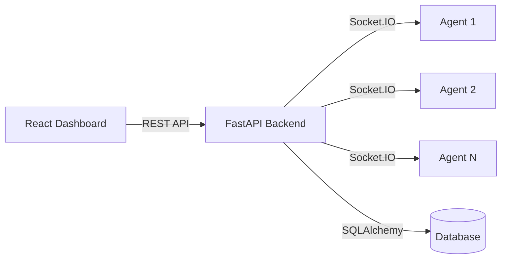

<div align="center">

# 🚀 DeployX

### Automated Deployment & Remote System Management Platform

[](LICENSE)
[](https://www.python.org/)
[](https://fastapi.tiangolo.com/)
[](https://reactjs.org/)

**DeployX** is a full-stack deployment automation platform that enables centralized management of software installations, command execution, and system monitoring across multiple machines. Deploy, control, and monitor your entire infrastructure from a single dashboard.

[Features](#-features) • [Architecture](#-architecture) • [Quick Start](#-quick-start) • [Agent Setup](#-agent-setup) • [API](#-api-documentation)

</div>

---

## 🌐 Overview

DeployX simplifies and automates deployment across distributed systems. Whether managing a handful of machines or an entire fleet, DeployX provides real-time control, automatic backup/rollback for destructive operations, scheduled tasks, and comprehensive monitoring — all from a web dashboard.


```mermaid
graph LR
    A[React Dashboard] -->|REST API| B[FastAPI Backend]
    B -->|Socket.IO| C[Agent 1]
    B -->|Socket.IO| D[Agent 2]
    B -->|Socket.IO| E[Agent N]
    B -->|SQLAlchemy| F[(Database)]
```

- **Frontend**: React dashboard with real-time updates via Socket.IO
- **Backend**: FastAPI server handling orchestration, auth, scheduling and state
- **Agent**: Lightweight Python client on target machines (Windows/Linux/macOS)
- **Communication**: Bidirectional Socket.IO events + REST APIs

---

## ✨ Features

### 🖥️ Agent Enrollment & Activation
- 🔑 **Activation Keys**: Generate time-limited keys from the dashboard; agents self-activate against the server
- ⚡ **One-Command Setup**: Copy a single PowerShell or bash command per key — it downloads the right agent binary for the OS, installs it to the startup folder (Windows) or autostart/systemd-user (Linux), and activates it automatically
- 🔄 **Auto-Update Channel**: Agents poll `/api/agent/updates` for new versions with checksum verification

### 🎯 Deployment Management
- 📦 **Software Deployment**: Install catalog software or custom commands across multiple machines
- 📄 **File Deployment**: Upload files once (local or picked straight from Google Drive) and distribute them to target paths on many devices
- 🔁 **Retries**: Re-run failed software deployments and reschedule failed scheduled tasks
- 📅 **Scheduled Tasks**: One-time, interval, or cron-style recurrence for commands, software and file deployments
- 🔙 **Backup & Rollback**: Automatic backups before destructive operations, with rollback/restore endpoints
- 🛡️ **Destructive Command Detection**: Dangerous commands (`rm -rf`, `del /s`, `format`, …) are flagged and backed up before execution

### 💻 Command Execution
- 💻 **Remote Shell Access**: Interactive CMD / PowerShell / Bash terminals in the browser (Xterm.js) with command-history navigation, interrupt (Ctrl+C), suspend and clear-screen support
- 👥 **Group Operations**: Execute commands or batches across device groups in parallel
- ⏸️ **Command Queue**: Persistent queue with pause/resume/delete, live output streaming, status tracking and statistics
- 🔀 **Deployment Strategies**: Sequential batch (with stop-on-failure), blue-green and canary flows

### 📊 Monitoring & Management
- 📈 **Dashboard Analytics**: Device health, deployment trends, system metrics and recent activity
- ❤️ **Heartbeats & Status**: Continuous online/offline tracking of every agent
- 🖥️ **Device Inventory**: OS, CPU, memory, disk and network details collected from every agent
- 🗂️ **Device Grouping**: Organize machines into logical groups with membership management
- 📝 **Logs**: Centralized activity logs with statistics and one-click Excel export
- 🔔 **Real-time Notifications**: Instant deployment/command results in the UI

### 🔐 Security
- 🔐 **JWT Authentication** with refresh tokens and Google OAuth (Firebase)
- 👤 **Account Management**: username change, email change (with verification link) and self-service account deletion
- 🧾 **Audit trail** of deployments, commands and results
- 📧 **Email verification**: signup OTPs, password resets and email-change links

---

## 🏗️ Architecture

### Tech Stack

#### **Backend**
| Technology | Purpose |
|-----------|---------|
| FastAPI | REST APIs + Socket.IO server |
| SQLAlchemy | ORM (PostgreSQL recommended, any DB via `DB_URL`) |
| python-socketio | Real-time agent/frontend communication |
| APScheduler | Task scheduling |
| JWT (python-jose) | Authentication tokens |
| Uvicorn | ASGI server |

#### **Frontend**
| Technology | Purpose |
|-----------|---------|
| React 18 + Vite | UI framework and build tooling |
| Tailwind CSS | Styling |
| Socket.IO Client | Real-time event handling |
| Xterm.js | In-browser terminal emulation |
| Firebase | Google OAuth |
| fetch-based ApiClient | Single HTTP client with token refresh |

#### **Agent**
| Technology | Purpose |
|-----------|---------|
| Python 3.8+ | Core runtime (packaged with PyInstaller) |
| Socket.IO Client | Server communication |
| psutil | System information |
| aiohttp | Async downloads |

---

## 🚀 Quick Start

### Prerequisites

- **Python** 3.8+
- **Node.js** 16+
- A database (PostgreSQL recommended)

### Backend

```bash
cd backend
python -m venv venv
venv\Scripts\activate        # Windows
# source venv/bin/activate   # Linux/Mac
pip install -r requirements.txt

# Create a .env next to start_server.py (see Configuration below)
python start_server.py       # serves app + Socket.IO on port 8000
```

### Frontend

```bash
cd frontend
npm install

# .env in frontend/:
#   VITE_API_URL=http://localhost:8000
#   VITE_SOCKET_URL=http://localhost:8000

npm run dev                  # http://localhost:5173
```

### Agent

```bash
cd agent
pip install -r requirements.txt
python main.py --server http://localhost:8000 --activation-key XXXX-XXXX-XXXX-XXXX
```

Useful flags: `--server`, `--agent-id`, `--advertise`, `--set-activation-key KEY`.
The key can also be provided via the `DEPLOYX_ACTIVATION_KEY` environment variable.

### Quick Test

1. Open the dashboard at `http://localhost:5173` and sign up
2. Run the agent on a target machine with a valid activation key
3. Verify the device appears **online**, open its terminal and run `echo hello`
4. Generate an activation key → copy its setup command → enroll more machines with one paste

---

## 🖥️ Agent Setup (One Command)

1. Place built agent binaries on the backend host inside `backend/agent_updates/`:
   - `DeployXAgent.exe` (Windows, PyInstaller build)
   - `deployx-agent-linux` (Linux binary)
2. In the dashboard go to **Activation Keys → ⌨ Setup Command** for your key.
3. Copy the line matching the target OS and run it there:

**Windows** (CMD or PowerShell):
```powershell
powershell -NoProfile -ExecutionPolicy Bypass -Command "irm 'https://your-server/api/agent/setup/bootstrap.ps1?key=XXXX-XXXX-XXXX-XXXX&server=https://your-server' | iex"
```

**Linux**:
```bash
curl -fsSL 'https://your-server/api/agent/setup/bootstrap.sh?key=XXXX-XXXX-XXXX-XXXX&server=https://your-server' | bash
```

What the script does: detects nothing it doesn't need to (it is already platform-specific), downloads the matching binary, installs it, registers autostart (`%APPDATA%\...\Startup\DeployXAgent.cmd` on Windows; systemd user service or desktop autostart entry on Linux), launches the agent, and activates it with your key.

---

## 📁 Project Structure

```
DeployX/
├── agent/                          # Python agent for target machines
│   ├── main.py                     # Entry point (CLI flags, reconnect loop)
│   ├── core/
│   │   ├── activation.py           # Activation-key handshake + local state
│   │   ├── backup_manager.py       # Backup creation/restore/delete
│   │   ├── command_executor.py     # Execution engine + rollback
│   │   ├── connection.py           # Socket.IO connection manager
│   │   ├── destructive_detector.py # Dangerous command analysis
│   │   └── shell_manager.py        # Shell session management
│   ├── handlers/socket_handlers.py # Socket event handlers
│   ├── installers/                 # downloader.py + installer.py
│   ├── network/service_advertiser.py # Optional mDNS advertising (--advertise)
│   └── utils/machine_id.py         # Machine fingerprinting
│
├── backend/
│   ├── app/
│   │   ├── main.py                 # App composition root (routers, CORS)
│   │   ├── config.py               # CORS/environment helpers
│   │   ├── sockets/                # Socket.IO server, ConnectionManager,
│   │   │                           # and all socket event handlers
│   │   ├── common/socket_base.py   # Shared executor plumbing
│   │   ├── auth/                   # Signup/login/OAuth/password flows
│   │   ├── activation/             # Activation keys CRUD + validation
│   │   ├── agent_setup/            # One-command bootstrap scripts + binaries
│   │   ├── agent_updates/          # Agent auto-update distribution
│   │   ├── agents/                 # Agent/device registry
│   │   ├── Devices/                # Device status endpoints
│   │   ├── grouping/               # Groups, group executor, target resolution
│   │   ├── command_deployment/     # Command queue, executor, strategies
│   │   ├── Deployments/            # Software deployments
│   │   ├── files/                  # Upload/deploy/file-system endpoints
│   │   ├── software/               # Software catalog
│   │   ├── schedule/               # Scheduled tasks + scheduler service
│   │   ├── dashboard/              # Analytics endpoints
│   │   └── logs/                   # Activity logs
│   └── start_server.py             # Uvicorn startup script
│
├── frontend/src/
│   ├── pages/                      # Home, Dashboard, ForgotPassword, ...
│   ├── components/                 # Terminal, managers, modals, ...
│   ├── services/api.js             # ApiClient (+ shared base URL export)
│   ├── utils/format.js             # Shared date/size formatters
│   └── App.jsx                     # Routes (Dashboard is lazy-loaded)
│
├── executable_agent_file/          # PyInstaller packaging + updater wrapper
├── tests/test_backup_rollback.py   # Pytest suite (detector/backup/rollback)
└── LICENSE
```

---

## 📖 API Documentation

Interactive docs once the backend is running:
- **Swagger UI**: `http://localhost:8000/docs`
- **ReDoc**: `http://localhost:8000/redoc`

### Key Routes

| Area | Endpoints |
|------|-----------|
| Auth (`/auth`) | `POST /auth/signup-request`, `/auth/signup-complete`, `/auth/login`, `/auth/google-auth`, `/auth/refresh`; password reset + email change flows under `/auth/*` |
| Devices (`/devices`) | `GET /devices/`, `POST /devices/` (status update) |
| Groups (`/groups`) | Group CRUD; `POST /groups/{id}/commands`, `POST /groups/{id}/commands/batch/sequential`; executions/batches status |
| Commands (`/api/deployment`) | `POST /commands`, `/commands/batch`, `/commands/batch/sequential`; `/{cmd_id}/pause\|resume\|rollback\|restore-backup`; `GET /stats` |
| Software deployments (`/deployments`) | `POST /install`, `GET /{deployment_id}/progress`, `/details`, `GET /by-date/{date}`, `POST /retry` |
| Files (`/files`) | `POST /files/upload`, `POST /files/deploy`, `GET /deployments` (history), progress, `DELETE /{file_id}`, remote filesystem ops |
| Software catalog (`/software`) | CRUD for catalog entries + categories |
| Logs (`/api/logs`) | List, stats, log details |
| Scheduling (`/api/schedule`) | Task CRUD, `pause/resume/execute`, executions history, stats |
| Dashboard (`/api/dashboard`) | `stats`, `recent-activity`, `deployment-trends`, `system-metrics`, `device-status-chart` |
| Activation (`/activation`) | `POST /generate`, `POST /validate`, `GET /keys`, `GET /check/{machine_id}` |
| Agent setup (`/api/agent/setup`) | `GET /commands/{key_id}`, `GET /bootstrap.ps1`, `GET /bootstrap.sh`, `GET /binary/{platform}` |
| Agent updates (`/api/agent/updates`) | `GET /check`, `GET /download/{platform}/{version}`, `GET /versions` |

Real-time communication (shell I/O, command output, agent registration, heartbeats) runs over **Socket.IO** — see `backend/app/sockets/handlers.py`.

---

## 🔧 Configuration

### Backend environment variables (`.env` next to `start_server.py`)

| Variable | Description | Default |
|----------|-------------|---------|
| `DB_URL` | Database connection string (**required**) | – |
| `JWT_SECRET_KEY` | JWT signing key | – |
| `ENVIRONMENT` | `development` or `production` (controls CORS defaults) | `development` |
| `FRONTEND_URL` / `FRONTEND_LOCAL_URL` | Allowed frontend origins | `https://deployxsystem.vercel.app` / `http://localhost:5173` |
| `SMTP_EMAIL` / `SMTP_PASSWORD` | SMTP account for OTP/reset/email-change mails | – (email disabled if unset) |
| `SMTP_HOST` / `SMTP_PORT` | SMTP server | smtp.gmail.com / 465 |
| `PUBLIC_SERVER_URL` | Override public URL used in generated setup commands | request origin |
| `AGENT_UPDATES_DIR` | Where agent binaries are served from | `./agent_updates` |

### Agent configuration

The agent is configured entirely via CLI flags and environment:

```text
--server URL                 Backend URL (default http://localhost:8000)
--agent-id ID                Custom agent ID (else derived from machine ID)
--activation-key KEY         Activate immediately on startup
--set-activation-key KEY     Store a key for service mode and exit
--advertise                  Advertise presence via mDNS (optional)
DEPLOYX_ACTIVATION_KEY       Env-var alternative for the activation key
```

---

## 🧪 Testing

From the repository root:

```bash
pytest tests
```

Covers destructive-command classification, backup create/info/list/delete, restore (default + custom path) and full command-executor rollback.

---

## 🚢 Production Deployment

- **Backend**: Render (or any host) — start command `python start_server.py`; set the env vars above.
- **Frontend**: Vercel — build `npm run build`, output `dist/`; set `VITE_API_URL` / `VITE_SOCKET_URL`.
- **Agents**: build executables with `executable_agent_file/build_all.bat|.sh`, drop them into `backend/agent_updates/`, then enroll machines with the one-command setup from the dashboard.

---

## 🤝 Contributing

1. **Fork** the repository
2. **Create** a feature branch (`git checkout -b feature/AmazingFeature`)
3. **Commit** your changes
4. **Push** and open a Pull Request

Guidelines: PEP 8 for Python, ESLint conventions for JS/React, add tests for new features.

---

## 📄 License

This project is licensed under the MIT License — see the [LICENSE](LICENSE) file for details.

---

## 👥 Contributors

<table>
  <tr>
    <td align="center">
      <a href="https://github.com/Ai-Chetan">
        
        <br />
        <sub><b>Chetan Chaudhari</b></sub>
      </a>
    </td>
    <td align="center">
      <a href="https://github.com/Nischay-loq">
        
        <br />
        <sub><b>Nischay Chavan</b></sub>
      </a>
    </td>
    <td align="center">
      <a href="https://github.com/ParthShikhare19">
        
        <br />
        <sub><b>Parth Shikhare</b></sub>
      </a>
    </td>
  </tr>
</table>

---

<div align="center">

**⭐ Star this repository if you find it helpful!**

Made with ❤️ by the DeployX Team

</div>
